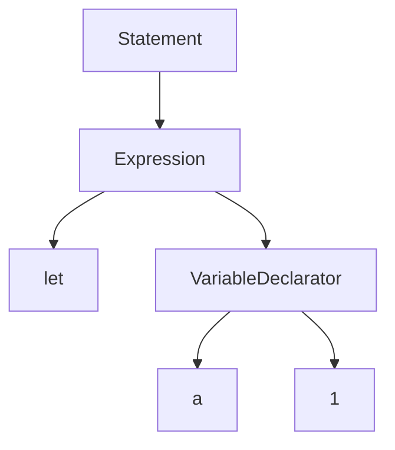

# 编译前端

词法分析和语法分析

## 词法分析

按照语法将文本分割为一个个Token（词素），用于下一步的语法分析。通常基于有限状态机来实现，或者直接基于正则表达式，大部分情况下两者是等价的。

## 语法分析

语法分析器会消费词法分析产生的Token，并按照给定的语法规则来生成抽象语法树（AST）。主流的算法有自顶向下（LL，PEG）和自底向上（LR，LALR）等。

::right::

